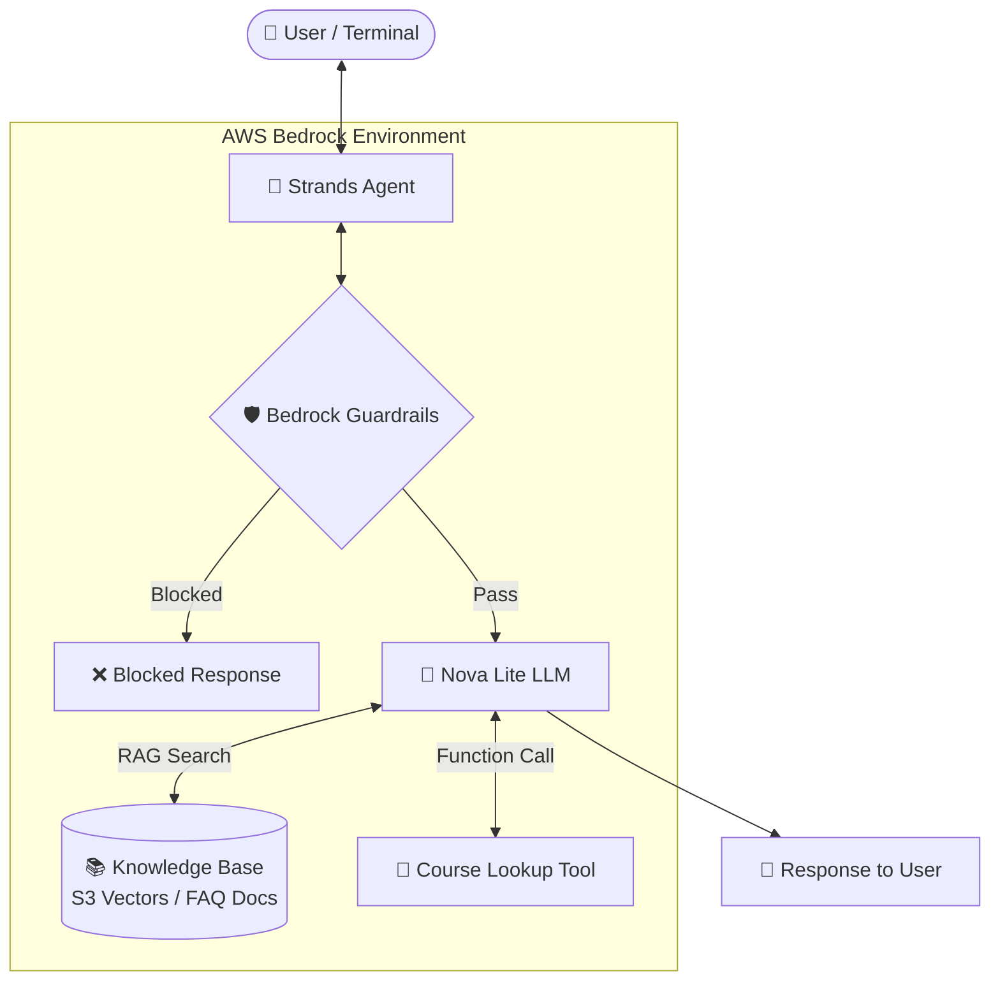

# Amazon Bedrock for Beginners – From First Prompt to AI Agent

Companion repository for the YouTube video and blog: **Amazon Bedrock for Beginners – From First Prompt to AI Agent**.

This repo contains code samples that take you from your first Bedrock API call to a fully working AI agent. By the end, you'll build a **University FAQ Chatbot** equipped with:
- **Knowledge Bases (RAG)** for contextual document retrieval.
- **Guardrails** for content safety and policy enforcement.
- **Tool Use (Function Calling)** for dynamic course lookups.
- **Strands Agents SDK** to orchestrate all components into a coherent agent.

---

## 🏛️ System Architecture

The diagram below illustrates how the user interacts with the final Strands-powered Agent and how requests flow through Bedrock's foundational models, guardrails, vector database, and custom tools:

